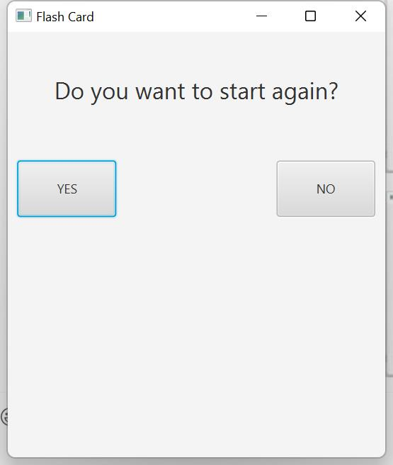

# Flash-Card-Project

This is a project using java language and javafx framework , using flash cards to help memorize java knowledge 

# Start Page

Choose one level to start

# Intro Page

How the flash card works

# Questions and Answers Page

questions and answers

# Finish Page

Ask users to start again or quit

